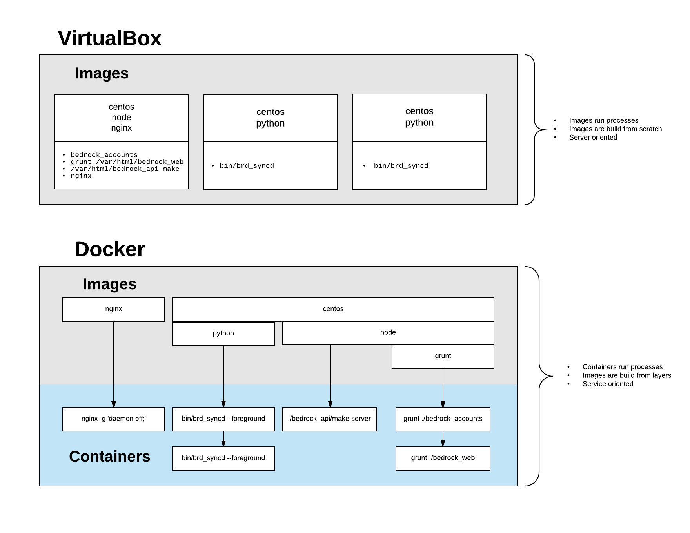

# Intro

[Back to table of contents...](README.md)

## What is Docker

Docker is the world's leading software container platform. *

\* source: Docker

## What is a container

Using containers, everything required to make a piece of software run is packaged into isolated containers. Unlike VMs, containers do not bundle a full operating system - only libraries and settings required to make the software work are needed. This makes for efficient, lightweight, self-contained systems and guarantees that software will always run the same, regardless of where it’s deployed.



## Running containers

### The Dockerfile

The Dockerfile defines the image that containers will run against.  A simple Dockerfile might look something like the example below.  More complex Dockerfile directives [are documented at docker.com](https://docs.docker.com/engine/reference/builder/#dockerignore-file)

```docker
# Use FROM you're building on top of an existing image layer.
# The format is repository/path/image-name:version-tag
FROM container_repository/node:0.10.43

# If you needs to specify a working directory
WORKDIR /usr/src/app

# Copy files from your local machine into the image
COPY ./package.json /usr/src/app/package.json

# Run any shell commands needed for the image to host its containers
RUN npm install --global grunt-cli
RUN npm install

# Specify the default container command
CMD grunt build
```

The above Dockerfile creates an image based upon a privately hosted Node 0.10 image.  It copies in a package.json file, installs it, and installs grunt globally.  It also declares `grunt build` as the default process to represent the container if nothing else is specified.

### Building an Image

With the above Dockerfile we can create a new image.

```sh
docker build --tag your-grunt-app .
```

This will tell Docker to create an image named your-grunt-app using `.` as the working directory.  By default, it will look for the Dockerfile at `./Dockerfile`, and it will tag it with `latest`.  So `--tag grunt-app` is the same as `--tag grunt-app:latest`.

You can list all available docker images using `docker images`.

```sh
$ docker images
REPOSITORY                                      TAG                 IMAGE ID            CREATED             SIZE
your   -grunt-app                               latest              991a00530576        5 minutes ago       98MB
nginx                                           latest              691ab4ba6dba        2 weeks ago         15.5MB
python                                          2.7                 fa8e55b2235d        3 weeks ago         673MB
python                                          3.3.6               87d1eb7b5ba5        3 weeks ago         673MB
redis                                           3.2.9               3459037fcc3a        3 weeks ago         98.9MB
```

### Creating Containers

```sh
docker run your-grunt-app
```

This will create a container from the your-grunt-app using the default process from the `CMD` declaration from the Dockerfile.  In this case it is `grunt build`.  The container lives until either `grunt build` finishes, or until the process is forcefully terminated.

```sh
docker run your-grunt-app ls -alh
```

This will run the process `ls -alh` against the your-grunt-app image, overriding the `CMD grunt build` directive in the Dockerfile.  This container lives only as long as it takes to list the contents of the working directory.

### Interacting with Containers

```sh
# List all running containers
$ docker ps
CONTAINER ID        IMAGE                COMMAND                  CREATED             STATUS              PORTS               NAMES
69aa1206ee76        your-grunt-app       "/bin/sh -c 'grunt..."   1 hour ago          Up 1 hour           80/tcp              frosty_wright
69aa1206ee76        some_api:latest      "/bin/sh -c 'make ..."   5 days ago          Up 5 days                               your_api
81a537440cbe        omni:latest          "/bin/sh -c 'npm s..."   7 days ago          Up 7 days                               omni
```

If you don't specify a container name with `docker run`, then [Docker will generate something random for you](https://github.com/moby/moby/blob/master/pkg/namesgenerator/names-generator.go).

```sh
docker logs frosty_wright
```

Docker collects as a log everything written to standard out by the container process.  `docker logs [-f]` will output this log.

```sh
docker exec frosty_wright ls -alh
```

This will execute the shell command `ls -alh` against the frosty_wright container.  This could produce the same output as `docker run your-grunt-app ls -alh`, but it might also be different if the `grunt build` process has had an effect on the working directory.

> `docker exec` runs commands against the container, where `docker run` runs against the image.

```sh
docker exec -it frosty_wright bash
```

This will execute `bash` against the running container, and the `-it` flag will give you an interactive terminal into the process.  This is similar to the Vagrant command `vagrant ssh`.

## Docker Compose

Docker compose is used for deploying multiple containers using a single configuration file.  It is useful when deploying containers with with similar function or external dependencies.

### docker-compose.yml

Docker compose is configured using a [yaml formatted file](https://docs.docker.com/compose/compose-file/).

```yaml
version: "3.3"
services:
  mongo:
    image: mongo
    # the external port 9999 will map to the internal mongo port
    ports:
      - target: 27017
        published: 9999
    # map the /data/db directory in the container to the external volume named 'mongoData'
    volumes:
      - mongoData:/data/db
  # redis is the service name
  redis:
    image: redis
    command: ["redis-server", "/usr/local/etc/redis/redis.conf"]
  sentinel:
    image: redis
    command: ["redis-server", "/usr/local/etc/redis/redis-sentinel.conf", "--sentinel"]

volumes:
  mongoData:
    driver: local
```

The above docker-compose.yml file creates three containers, a MongoDb container, a Redis container, and a Redis Sentinel container.  Each container will run against a pre-built image pulled from Bedrock's private container registry.

### Creating containers

```sh
docker-compose up
```

Without any parameters, `docker-compose` will look for the file `./docker-compose.yml` and will create containers defined in that file.

```sh
docker-compose --file ./some-other-compose.yml up -d
```

You can also specify an alternative location for the `docker-compose.yml` file, and run the containers in the background using the `-d` flag.

```sh
docker-compose restart redis
```

You can also target just a single service in the `docker-compose.yml` file.  The above command only targets the `redis` service from the compose file.