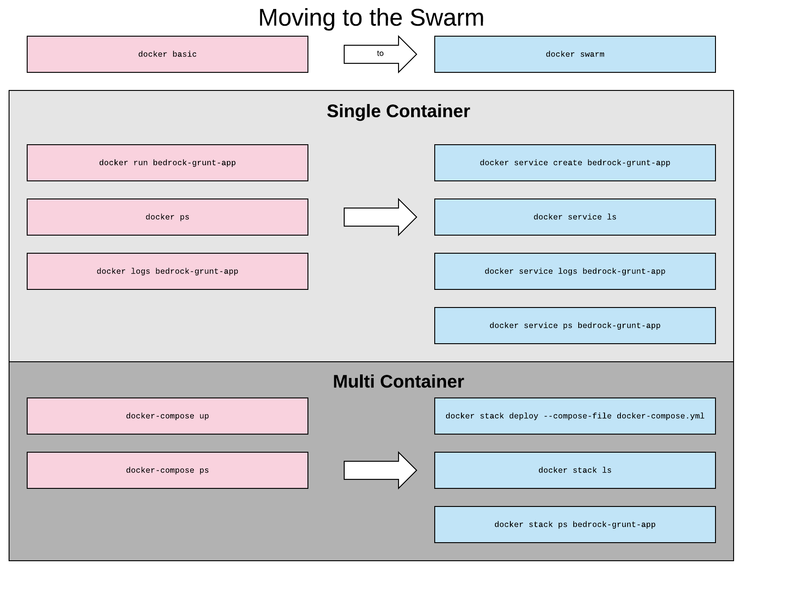

# Docker Swarm Basics

[Back to table of contents...](README.md)

## Overview

Docker swarm creates a manager-worker configuration for your Docker services.

A swarm manager handles:

* Container scaling and node placement
* Replication
* Load balancing
* Failure recovery

A swarm worker handles:

* Running containers
* Storing local container data

## Docker basic vs Docker Swarm

Working with a Docker swarm is similar to working with Docker basic.  When working with single container deployments in the swarm, use `docker service` instead of `docker run`, and when working with multi container deployments use `docker stack` instead of `docker-compose`.

For multi container deploys you can use the same `docker-compose.yml` file for `docker-compose` and for `docker stack`.  There are a couple of mutually exclusive features for each type of deploy, but they will be ignored.  See the [Docker Compose file version 3.3 reference](https://docs.docker.com/compose/compose-file/) for more detailed information.